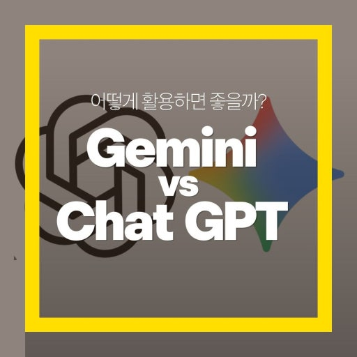

# 4. comparison.md (ChatGPT vs Gemini)

### 1. 모델 엔진 및 서비스 철학
두 도구는 각기 다른 엔진을 기반으로 개발되어 고유한 강점을 가지고 있다.
* ChatGPT: OpenAI의 GPT 모델 기반, 논리적 추론과 창의적 텍스트 생성에 특화
* Gemini: Google의 자체 멀티모달 모델 기반, 구글 서비스와의 유기적 통합 강조

### 2. 최신 정보 반영 및 검색 능력
실시간 정보에 접근하고 이를 활용하는 방식에서 차이를 보인다.
* ChatGPT: 브라우징 기능을 통한 검색 및 고도화된 데이터 분석(Advanced Data Analysis)
* Gemini: 구글 검색 엔진과의 강력한 연동, 최신 뉴스 및 정보 업데이트 속도 우위

### 3. 생태계 연동 및 편의 기능
사용자가 주로 사용하는 작업 환경에 따라 도구의 효용성이 달라진다.
* ChatGPT: 사용자 맞춤형 GPTs 제작 가능, 다양한 서드파티 앱 연동
* Gemini: 구글 워크스페이스(문서, 시트, 지메일)와의 연동을 통한 문서 작업 최적화

### 4. 멀티모달 및 부가 기능 비교
텍스트 외에 이미지, 코드, 음성 등을 처리하는 방식의 차이점이다.
* 텍스트 처리: 정교한 문체 조절은 ChatGPT, 간결한 요약은 Gemini 강세
* 이미지 생성: DALL-E 3를 활용한 고품질 생성 vs Imagen 모델 기반의 빠른 생성
* 코드 분석: 복잡한 로직 설계는 ChatGPT, 대규모 코드 문맥 파악은 Gemini 유리

### 5. 요약: 상황별 최적의 도구 선택
목적에 맞는 도구를 선택할 때 작업의 효율을 극대화할 수 있다.
* ChatGPT 추천: 창의적 글쓰기, 심층적인 코딩 상담, 복잡한 논리 분석
* Gemini 추천: 최신 트렌드 조사, 구글 문서 협업, 빠르고 간결한 정보 요약

